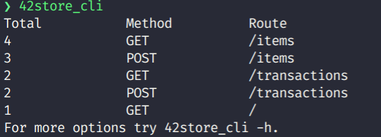

<h1 align="center"><b>42 Store API</b></h1>

## **ABOUT THE PROJECT**

This project was done during the 42Labs (internship) selection process of [42 São Paulo](https://www.42sp.org.br/). The main goal was to create a REST API using C, collect logs of the application and also a CLI to visualize the logs.

## **API**

The main idea of this API is to be used to control inventory of the 42Store.

### **Main functionalities**

- [x]  **`List endpoints`**: The user can list all available endpoints.

	**GET** /

- [x]  **`List items`**: The user can list all created items.

	**GET** /items

- [x]  **`Create item`**: The user can create an item.

	**POST** /items
	```json
	{
		"name": "item_name"
	}
	```
	### **Parameters:**

	**name**: A string containing the item name.


- [x]  **`List transactions`**: The user can list all created transactions.

	**GET** /transactions

- [x]  **`Create transactions`**: The use can create a transaction.

	**POST** /transactions
	```json
	{
		"item_id": 42,
		"item_quantity": 42, 
		"type": "in"
	}
	```

	### **Parameters:**

	**item_id**: An int of an already created item id.

	**item_quantity**: An int for the item quantity.

	**type**: A string containing **in** or **out** depending on the type of the transaction.

___

## **CLI**
<p align="center">

  

</p>

### The main goal of the CLI is to be a user-friendly tool to visualise the logs generated by the API.

___

## **Preparing the environment**

### First of all, you need to install [Docker](https://docs.docker.com/engine/install/).

### To set up the database, run on your terminal:
```sh
docker run --name 42labsdb -p 3306:3306 -d acarneirosousa/42labsdb:v0
```

### To build the API and CLI applications, use the following lines on your terminal:
```sh
git clone https://github.com/a-cs/42StoreAPI.git 42store
```
```sh
cd 42store
```
```sh
sudo apt-get update
```
```sh
sudo apt-get install libmysqlclient-dev
```
```sh
make
```
```sh
export PATH=$PATH:$(pwd)
```
___

## **Running the applications**

### To run the API, type on your terminal:

```sh
42store_api
```
##### *make sure the database container is running before starting the API.

### To run the CLI, type on your terminal:

```sh
42store_cli
```
##### *make sure the database container is running before starting the CLI.
